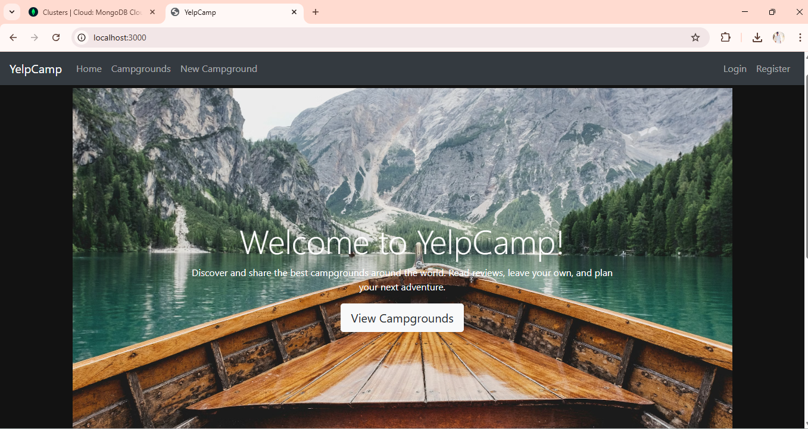
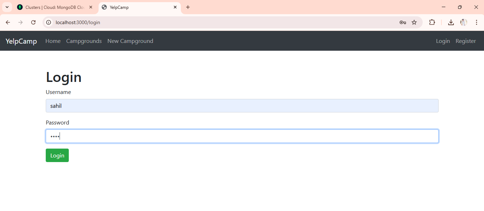
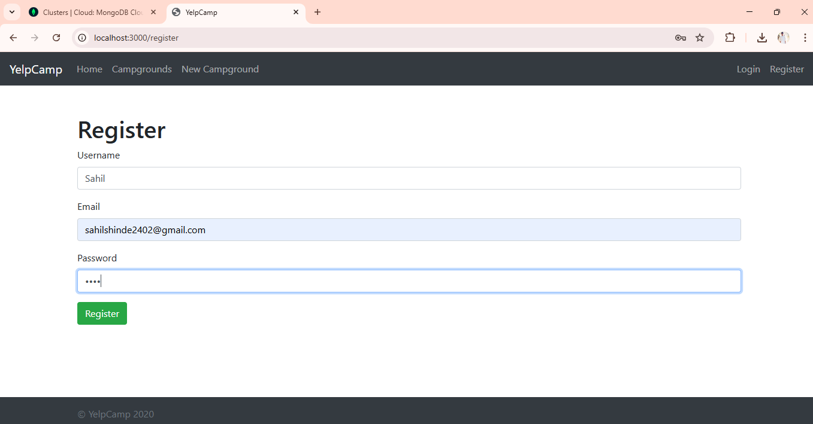
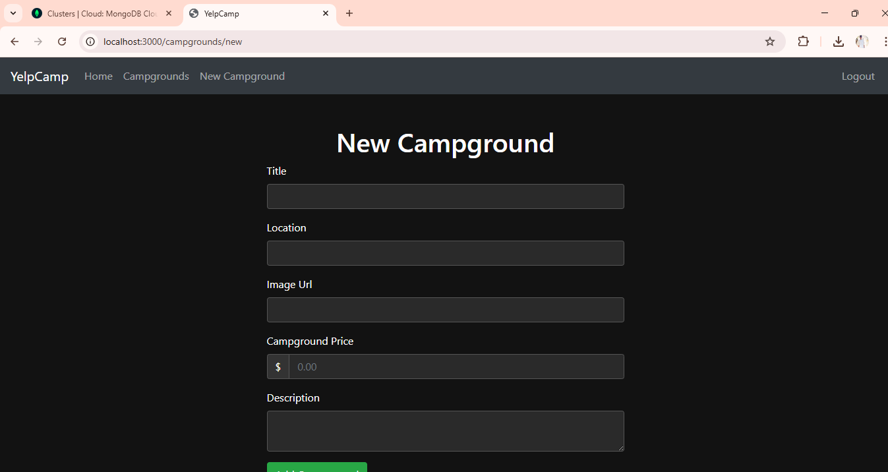
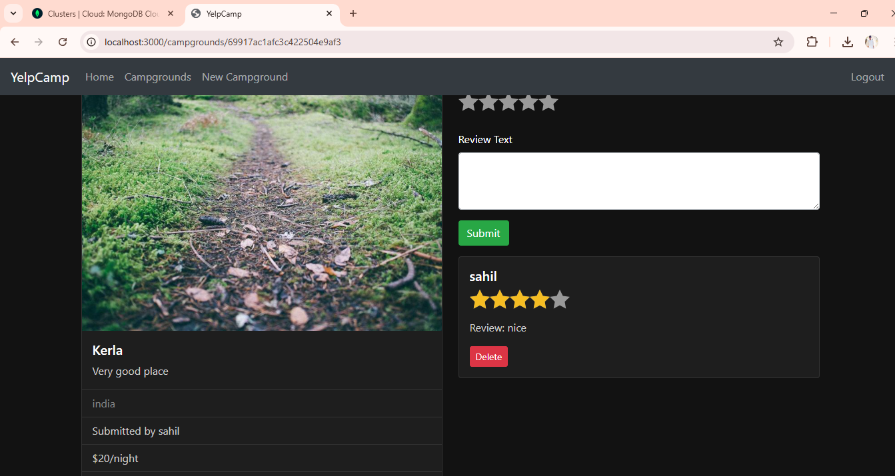

<<<<<<< HEAD
# YelpCamp

YelpCamp is a full-stack web application that allows users to view, create, edit, and review campgrounds. It's built as a Yelp-like platform specifically for camping enthusiasts to share and discover great camping spots.

## Features

- **User Authentication**: Register, login, and logout functionality using Passport.js
- **Campground Management**: Create, view, edit, and delete campgrounds
- **Review System**: Leave reviews and ratings for campgrounds
- **Responsive Design**: Mobile-friendly interface with Bootstrap styling
- **Flash Messages**: User feedback for actions like successful updates or errors
- **Image Upload**: Support for campground images (via URLs)
- **Search and Filter**: Browse campgrounds by location and other criteria

## Tech Stack

- **Backend**: Node.js, Express.js
- **Database**: MongoDB with Mongoose ODM
- **Frontend**: EJS templating engine, Bootstrap CSS framework
- **Authentication**: Passport.js with Local Strategy
- **Validation**: Joi for input validation
- **Session Management**: Express Session with connect-flash
- **Other**: Method Override for PUT/DELETE requests

## Installation

1. **Clone the repository**:
   ```bash
   git clone https://github.com/yourusername/yelpcamp.git
   cd yelpcamp
   ```

2. **Install dependencies**:
   ```bash
   npm install
   ```

3. **Set up MongoDB**:
   - Ensure MongoDB is installed and running on your system
   - The app connects to `mongodb://localhost:27017/yelp-camp` by default

4. **Seed the database** (optional):
   ```bash
   node seeds/index.js
   ```

5. **Start the server**:
   ```bash
   node app.js
   ```

6. **Open your browser** and navigate to `http://localhost:3000`

## Usage

- Visit the home page to see featured campgrounds
- Register a new account or login with existing credentials
- Browse campgrounds on the index page
- View detailed information about a campground, including reviews
- Add new campgrounds (requires login)
- Edit or delete campgrounds you own
- Leave reviews on campgrounds

## Project Structure

```
yelpcamp/
├── controllers/          # Route handlers
├── models/               # Mongoose schemas
├── routes/               # Express routes
├── views/                # EJS templates
│   ├── campgrounds/      # Campground-related views
│   ├── layouts/          # Base layout templates
│   ├── partials/         # Reusable components
│   └── users/            # User authentication views
├── public/               # Static assets (CSS, JS, images)
├── seeds/                # Database seeding scripts
├── utils/                # Utility functions
├── app.js                # Main application file
├── package.json          # Dependencies and scripts
└── README.md             # This file
```

## Contributing

1. Fork the repository
2. Create a feature branch (`git checkout -b feature/AmazingFeature`)
3. Commit your changes (`git commit -m 'Add some AmazingFeature'`)
4. Push to the branch (`git push origin feature/AmazingFeature`)
5. Open a Pull Request


## Acknowledgments

- Built following the Colt Steele Web Developer Bootcamp curriculum
- Inspired by Yelp.com
- Icons and styling adapted from Bootstrap
=======
# 🏕️ YelpCamp

<p align="center">
  
  
  
  
</p>

> A full-stack web application for camping enthusiasts to discover, share, and review campgrounds across the world. Built similar to Yelp, but specifically for camping spots!

## ✨ Features

- **🔐 User Authentication**
  - Secure registration and login system
  - Session-based authentication with Passport.js
  - Protected routes for authorized actions

- **🏕️ Campground Management**
  - Create new campgrounds with detailed information
  - View all campgrounds in a beautiful grid layout
  - Edit and update existing campgrounds
  - Delete campgrounds (owners only)
  - Display campground location information

- **⭐ Review System**
  - Leave reviews and ratings on campgrounds
  - Star rating system (1-5 stars)
  - View all reviews for each campground
  - Delete own reviews

- **📱 Responsive Design**
  - Mobile-friendly interface
  - Bootstrap-powered styling
  - Modern and clean UI

- **💬 Flash Messages**
  - Success notifications
  - Error messages
  - User-friendly feedback

- **🖼️ Image Support**
  - Upload campground images via Cloudinary
  - Image URL support
  - Responsive image display

- **🔍 Search & Browse**
  - Browse campgrounds by location
  - Filter and search capabilities

## 🛠️ Tech Stack

### Backend
- **Runtime**: Node.js
- **Framework**: Express.js
- **Database**: MongoDB with Mongoose ODM
- **Authentication**: Passport.js with Local Strategy
- **Validation**: Joi
- **Session**: Express Session with connect-flash

### Frontend
- **Templating**: EJS (Embedded JavaScript)
- **Styling**: Bootstrap CSS Framework
- **Maps**: Leaflet with OpenStreetMap tiles (free, no token needed)

### Cloud Services
- **Image Storage**: Cloudinary
- **Database**: MongoDB (local or Atlas)

## 📋 Prerequisites

Before running YelpCamp, make sure you have the following installed:

- **Node.js** (v14 or higher)
- **MongoDB** (v4.4 or higher)
- **npm** or **yarn**

## 🚀 Installation

1. **Clone the repository:**
   
```
bash
   git clone https://github.com/yourusername/yelpcamp.git
   cd yelpcamp
   
```

2. **Install dependencies:**
   
```
bash
   npm install
   
```

3. **Set up MongoDB:**
   - Ensure MongoDB is installed and running on your system
   - The app connects to `mongodb://localhost:27017/yelp-camp` by default
   - Or use MongoDB Atlas for cloud database

4. **Configure environment variables:**
   
   Create a `.env` file in the root directory and add the following:
   
```
env
   # Database
   MONGO_URI=mongodb://localhost:27017/yelp-camp
   
   # Session
   SESSION_SECRET=your-secret-key-here
   
   # Cloudinary (for image upload)
   CLOUDINARY_CLOUD_NAME=your-cloud-name
   CLOUDINARY_KEY=your-api-key
   CLOUDINARY_SECRET=your-api-secret
   
```

5. **(Optional) Seed the database:**
   If you want to populate the database with sample campgrounds:
   
```
bash
   node seeds/index.js
   
```

6. **Start the server:**
   
```
bash
   node app.js
   # or
   npm start
   
```

7. **Open your browser:**
   Navigate to `http://localhost:3000`

## 📖 Usage

### Getting Started
1. Visit the home page to see featured campgrounds
2. Click "Register" to create a new account
3. Login with your credentials
4. Browse campgrounds on the index page

### Creating a Campground
1. Click "New Campground" in the navigation
2. Fill in the required information:
   - Title
   - Price per night
   - Image URL
   - Description
   - Location
3. Click "Create Campground"

### Leaving a Review
1. Navigate to any campground detail page
2. Scroll to the reviews section
3. Fill in your rating (1-5 stars) and review text
4. Click "Submit Review"

### Managing Your Content
- **Edit**: Click "Edit" on your own campgrounds
- **Delete**: Click "Delete" to remove a campground (confirmation required)
- **Reviews**: Delete your own reviews from the campground page

## 📁 Project Structure

```
yelpcamp/
├── controllers/          # Route handlers and business logic
│   ├── campgrounds.js   # Campground CRUD operations
│   ├── reviews.js       # Review management
│   └── users.js         # User authentication
├── models/              # Mongoose schemas
│   ├── campground.js    # Campground model
│   ├── review.js        # Review model
│   └── user.js          # User model
├── routes/              # Express route definitions
│   ├── campgrounds.js   # Campground routes
│   ├── reviews.js       # Review routes
│   └── users.js         # User routes
├── views/               # EJS templates
│   ├── campgrounds/     # Campground views
│   │   ├── index.ejs    # Campground listing
│   │   ├── show.ejs     # Campground details
│   │   ├── new.ejs      # New campground form
│   │   └── edit.ejs     # Edit campground form
│   ├── users/           # User views
│   │   ├── login.ejs    # Login page
│   │   └── register.ejs # Registration page
│   ├── layouts/         # Base templates
│   └── partials/       # Reusable components
├── public/              # Static assets
│   ├── stylesheets/     # CSS files
│   └── javascripts/     # Client-side JS
├── seeds/               # Database seeding
├── utils/               # Utility functions
├── cloudinary/          # Cloudinary configuration
├── app.js               # Main application entry
└── package.json         # Dependencies
```

## 🔧 API Routes

### Campgrounds
| Method | Route | Description |
|--------|-------|-------------|
| GET | `/campgrounds` | List all campgrounds |
| GET | `/campgrounds/new` | Show new campground form |
| POST | `/campgrounds` | Create new campground |
| GET | `/campgrounds/:id` | Show campground details |
| GET | `/campgrounds/:id/edit` | Show edit form |
| PUT | `/campgrounds/:id` | Update campground |
| DELETE | `/campgrounds/:id` | Delete campground |

### Reviews
| Method | Route | Description |
|--------|-------|-------------|
| POST | `/campgrounds/:id/reviews` | Add review |
| DELETE | `/campgrounds/:id/reviews/:reviewId` | Delete review |

### Users
| Method | Route | Description |
|--------|-------|-------------|
| GET | `/register` | Show registration form |
| POST | `/register` | Register new user |
| GET | `/login` | Show login form |
| POST | `/login` | Login user |
| GET | `/logout` | Logout user |

## 📸 Screenshots

<!-- Add your screenshot below by replacing the filename -->







## 🐛 Troubleshooting

### Common Issues

**MongoDB Connection Error**
- Make sure MongoDB is running: `mongod`
- Check the connection string in `.env`

**Cloudinary Upload Issues**
- Verify your Cloudinary credentials in `.env`
- Check API keys are correct

**Session Errors**
- Ensure `SESSION_SECRET` is set in `.env`
- Clear browser cookies and try again

**Port Already in Use**
- Change the port in `app.js` or use environment variable

## 📄 License

This project is licensed under the ISC License.

## 🙏 Acknowledgments

- Built following the Colt Steele Web Developer Bootcamp curriculum
- Inspired by [Yelp](https://www.yelp.com/)
- Map functionality powered by [Leaflet](https://leafletjs.com/) and [OpenStreetMap](https://www.openstreetmap.org/)
- Image hosting by [Cloudinary](https://cloudinary.com/)
- Icons from [Bootstrap Icons](https://icons.getbootstrap.com/)

---

<p align="center">
  Made with ❤️ by Sahil shinde camping enthusiasts, for camping enthusiasts
</p>
>>>>>>> eb599dad206d5d6eabb145f2fb394211996dbb89
